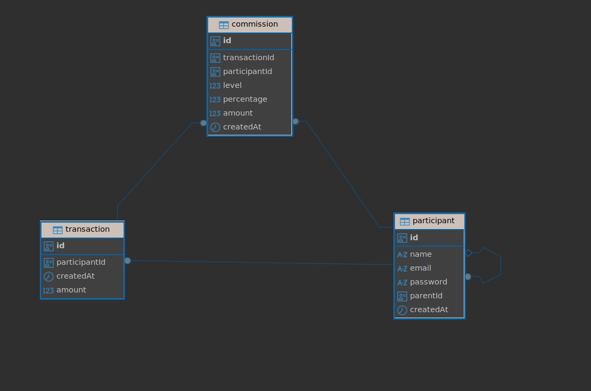

  

# Commisions API

## Por favor revisar la documentacion de los endpoints en https://commissions-back.onrender.com/api/docs

1. Clonar proyecto
2. `npm i`
3. Clonar el archivo `.env.template` y renombrarlo a `.env`
4. Cambiar las variables de entorno
5. Levantar: `npm run start`

# Commission System API 🚀

Backend desarrollado con **NestJS + PostgreSQL + TypeORM** para gestionar
un sistema de **comisiones multinivel (hasta 3 niveles)** basado en
transacciones realizadas por participantes afiliados.

---

## 🧠 Descripción del negocio

Cada vez que un participante realiza una transacción, el sistema:

- Registra la transacción
- Calcula automáticamente las comisiones para sus afiliados superiores
- Genera comisiones hasta **3 niveles**:

---

## 🗂️ Modelo de datos

El sistema está compuesto por tres entidades principales:

- **Participant**: Usuarios afiliados en estructura jerárquica
- **Transaction**: Ventas realizadas por participantes
- **Commission**: Comisiones generadas por cada transacción

### 📌 Diagrama Entidad-Relación

---
